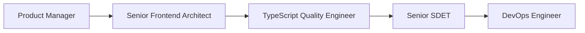

# Role Chaining and Parallel Workflow Strategies

This document outlines proven strategies for combining multiple specialized roles to tackle complex development tasks effectively.

## Role Chaining Workflows

Role chaining involves using multiple roles sequentially, where each role builds upon the previous role's output. This approach leverages specialized expertise at each phase of development.

### 1. Feature Development Chain

**Sequence**: Product Manager → Senior Frontend Architect → TypeScript Quality Engineer → Senior SDET



**Use Case**: Implementing new portfolio features (e.g., blog, testimonials, advanced analytics)

**Workflow**:
1. **Product Manager**: Define requirements, success metrics, user stories
2. **Senior Frontend Architect**: Design technical architecture and component structure
3. **TypeScript Quality Engineer**: Implement with proper type safety and code quality
4. **Senior SDET**: Create comprehensive test coverage
5. **DevOps Engineer**: Deploy with proper CI/CD integration

### 2. Bug Fix and Optimization Chain

**Sequence**: Senior SDET → Cybersecurity Engineer → TypeScript Quality Engineer → UI/UX Design Engineer

**Use Case**: Resolving complex issues that span multiple domains

**Workflow**:
1. **Senior SDET**: Reproduce bug, create failing test cases
2. **Cybersecurity Engineer**: Assess security implications
3. **TypeScript Quality Engineer**: Implement fix with proper type safety
4. **UI/UX Design Engineer**: Ensure user experience isn't compromised

### 3. Security Review Chain

**Sequence**: Cybersecurity Engineer → TypeScript Quality Engineer → DevOps Engineer → Senior SDET

**Use Case**: Comprehensive security assessment and hardening

**Workflow**:
1. **Cybersecurity Engineer**: Identify vulnerabilities and security requirements
2. **TypeScript Quality Engineer**: Implement secure coding practices
3. **DevOps Engineer**: Configure security controls in CI/CD
4. **Senior SDET**: Validate security controls through testing

## Parallel Role Strategies

Parallel execution involves running multiple Claude instances with different roles simultaneously, then synthesizing their outputs.

### 1. Code Review Parallel Strategy

**Simultaneous Roles**: Senior Frontend Architect + TypeScript Quality Engineer + Cybersecurity Engineer

**Use Case**: Comprehensive pull request review

**Implementation**:
```yaml
Parallel Review Process:
- Instance A (Architect): Architecture and design patterns
- Instance B (Quality): Code quality and type safety  
- Instance C (Security): Security vulnerabilities and best practices

Synthesis: Combine insights into unified review feedback
```

### 2. Feature Planning Parallel Strategy

**Simultaneous Roles**: Product Manager + Senior Frontend Architect + UI/UX Design Engineer

**Use Case**: Feature specification and design

**Implementation**:
- **Product Manager**: Business requirements and success metrics
- **Senior Frontend Architect**: Technical feasibility and implementation approach
- **UI/UX Design Engineer**: User experience and design considerations

### 3. Performance Optimization Parallel Strategy

**Simultaneous Roles**: Senior Frontend Architect + DevOps Engineer + UI/UX Design Engineer

**Use Case**: Comprehensive performance improvement

**Implementation**:
- **Senior Frontend Architect**: Code and bundle optimization
- **DevOps Engineer**: Infrastructure and deployment optimization
- **UI/UX Design Engineer**: User experience and visual performance

## Context-Aware Role Selection

### Task Type → Role Mapping

| Task Category | Primary Role | Supporting Roles |
|---------------|--------------|------------------|
| **New Feature** | Product Manager | Architect → Quality → SDET |
| **Bug Fix** | Senior SDET | Security → Quality |
| **Performance** | Senior Frontend Architect | DevOps → UX |
| **Security Issue** | Cybersecurity Engineer | Quality → DevOps |
| **UI/UX Problem** | UI/UX Design Engineer | Architect → Quality |
| **CI/CD Issue** | DevOps Engineer | Quality → SDET |
| **Documentation** | Open Source Maintainer | Product → Architect |
| **Code Review** | TypeScript Quality Engineer | Architect → Security |

### Complexity-Based Role Selection

#### Low Complexity (Single Role)
- Simple bug fixes → TypeScript Quality Engineer
- Minor UI adjustments → UI/UX Design Engineer  
- Documentation updates → Open Source Maintainer
- Configuration changes → DevOps Engineer

#### Medium Complexity (2-3 Roles)
- Component refactoring → Architect + Quality Engineer
- Test implementation → SDET + Quality Engineer
- Security hardening → Security + DevOps Engineer
- Performance optimization → Architect + DevOps

#### High Complexity (4+ Roles, Chaining)
- Major feature development → Full chain workflow
- Architecture overhaul → Architect → Quality → SDET → DevOps
- Security audit → Security → Quality → DevOps → SDET
- Platform migration → Product → Architect → DevOps → SDET

## Best Practices for Role Workflows

### 1. Context Preservation
```markdown
Role Handoff Template:
---
**Previous Role**: [Role Name]
**Key Decisions**: [List major decisions made]
**Constraints Identified**: [Technical/business constraints]
**Next Role Instructions**: [Specific guidance for next role]
**Context**: [Relevant project context to preserve]
---
```

### 2. Decision Documentation
- Document architectural decisions from Architect role
- Track security requirements from Security Engineer role
- Maintain quality standards from Quality Engineer role
- Record test strategies from SDET role

### 3. Conflict Resolution
When roles provide conflicting recommendations:
1. **Security vs Performance**: Security Engineer has final say
2. **Architecture vs Quality**: Collaborative resolution required
3. **Product vs Technical**: Product Manager provides business context, technical roles assess feasibility
4. **UX vs Performance**: Data-driven decision based on user impact

### 4. Efficiency Optimization

#### Parallel Processing Guidelines
- Use parallel roles for independent analysis
- Synthesize results before making final decisions
- Avoid redundant analysis across roles
- Focus each role on their core expertise

#### Chain Optimization
- Skip intermediate roles for simple changes
- Use abbreviated role definitions for minor tasks
- Maintain role context between handoffs
- Document decisions to avoid re-analysis

## Success Metrics for Role Workflows

### Quantitative Metrics
- **Task Completion Time**: Compare single-role vs multi-role approaches
- **Error Rate**: Bugs introduced per feature/fix
- **Code Quality**: TypeScript errors, ESLint violations, test coverage
- **Security Score**: Vulnerability counts, security best practice adherence

### Qualitative Metrics
- **Decision Quality**: Long-term maintainability of architectural choices
- **User Experience**: Accessibility compliance, performance impact
- **Team Alignment**: Consistency with project goals and standards
- **Learning Value**: Knowledge transfer and skill development

## Implementation Checklist

### Setting Up Role Workflows
- [ ] Identify task complexity and appropriate role strategy
- [ ] Prepare context and constraints for each role
- [ ] Define success criteria and quality gates
- [ ] Plan role handoff procedures and documentation
- [ ] Establish conflict resolution processes

### Executing Role Workflows
- [ ] Activate first role with complete context
- [ ] Document key decisions and constraints
- [ ] Hand off to next role with preserved context
- [ ] Synthesize multi-role outputs effectively
- [ ] Validate final output against success criteria

### Optimizing Role Workflows  
- [ ] Track metrics and identify bottlenecks
- [ ] Refine role definitions based on effectiveness
- [ ] Optimize context handoff procedures
- [ ] Document successful workflow patterns
- [ ] Train team on effective role utilization

---

**Note**: These workflow strategies are designed specifically for the enterprise intelligence portfolio project. Adapt the role combinations and sequences based on your specific project needs and team structure.