# GitHub Workflow System for Claude Code Feature Planning

**Date**: May 26, 2025  
**Status**: Implementation Complete - Ready for Use

## Overview

This document describes our enterprise-grade GitHub workflow system that transforms Claude Code's text-based planning approach into structured GitHub discussions and automated issue generation. The system replaces static markdown planning documents with dynamic, trackable project management.

## System Architecture

### Workflow Transformation

**Before**: Text-heavy planning documents created as standalone markdown files  
**After**: Structured GitHub discussions → Automated issue generation → Project tracking

```mermaid
graph TD
    A[💡 Feature Idea] --> B[📋 Planning Discussion]
    B --> C[🔍 Multi-Role Analysis]
    C --> D[✅ Ready for Implementation]
    D --> E[🤖 Automated Issue Creation]
    E --> F[📊 Project Board Tracking]
    F --> G[🚀 Development Execution]
```



## Component Overview

### 1. Discussion Templates

#### Feature Planning Template (`.github/DISCUSSION_TEMPLATE/feature-planning.yml`)

**Five-Role Analysis Framework**:
- **📊 Product Manager**: User stories, acceptance criteria, business value
- **🎨 UI/UX Engineer**: User experience design, interface patterns, accessibility
- **🏗️ Frontend Architect**: Technical design, component architecture, integration
- **🔧 TypeScript Quality Engineer**: Type safety, validation, coding standards
- **🧪 Senior SDET**: Testing strategy, quality gates, automation

**Key Features**:
- Structured form inputs with validation
- Required completion checklist
- Complexity assessment dropdown
- Implementation phase planning
- Automatic labeling system

### 2. Automated Issue Generation

#### Workflow: `discussion-to-issues.yml`

**Trigger**: Discussion labeled with `ready-for-implementation`

**Generated Issues**:
1. **Epic Issue**: High-level feature tracking with links to implementation issues
2. **UI/UX Implementation**: User experience and interface development
3. **Frontend Architecture**: Technical implementation and component structure
4. **TypeScript Integration**: Type safety and validation implementation
5. **Testing Implementation**: Comprehensive testing strategy execution

**Automation Features**:
- Parses discussion content automatically
- Creates structured issues with relevant sections
- Links all issues to the epic for tracking
- Applies appropriate labels for organization
- Updates epic with actual issue numbers

### 3. Issue Templates

#### Bug Report Template (`bug_report.yml`)
- Structured bug reporting with reproduction steps
- Browser and device information collection
- Expected vs actual behavior documentation
- Validation checklist for complete reports

#### Feature Request Template (`feature_request.yml`)
- Problem statement and proposed solution
- User benefit assessment
- Priority level assignment
- Complexity assessment checkboxes
- Recommendation for planning process

## Usage Guide

### Planning a New Feature

#### Step 1: Create Planning Discussion
1. Navigate to repository discussions
2. Use "Feature Planning" template
3. Fill out all five role-based sections:
   - Product Manager analysis
   - UI/UX design requirements
   - Frontend architecture planning
   - TypeScript implementation details
   - Testing strategy
4. Complete implementation phases breakdown

#### Step 2: Multi-Role Review
- Review each section for completeness
- Ensure all acceptance criteria are defined
- Validate technical approach and dependencies
- Confirm testing strategy covers all scenarios
- Check ready-for-implementation checklist

#### Step 3: Automated Issue Generation
1. Add `ready-for-implementation` label to discussion
2. GitHub Actions automatically creates:
   - Epic issue for high-level tracking
   - Individual implementation issues for each area
   - Proper linking and labeling
3. Issues appear in project board automatically

#### Step 4: Development Execution
- Assign team members to specific implementation issues
- Track progress through issue comments and status updates
- Use epic issue for high-level milestone tracking
- Close issues as implementation completes

### Quality Gates

#### Discussion Approval Criteria
- [ ] All five role sections completed
- [ ] User stories include acceptance criteria
- [ ] Technical architecture clearly defined
- [ ] Type safety approach documented
- [ ] Comprehensive testing strategy outlined
- [ ] Implementation phases realistic and detailed
- [ ] Dependencies and risks identified

#### Issue Creation Standards
- Epic issue includes complete overview and tracking
- Implementation issues have clear scope and requirements
- All issues properly labeled and linked
- Acceptance criteria transferred from discussion
- Technical requirements clearly documented

## Benefits

### For Development Teams
- **Structured Planning**: Consistent five-role analysis ensures comprehensive planning
- **Automated Tracking**: Reduces manual project management overhead
- **Clear Accountability**: Each role has defined responsibilities and deliverables
- **Quality Assurance**: Built-in quality gates prevent incomplete planning

### For Project Management
- **Visibility**: Clear tracking from idea to implementation
- **Metrics**: GitHub insights provide development velocity data
- **Consistency**: Standardized process across all features
- **Documentation**: Complete audit trail for all decisions

### For Stakeholders
- **Transparency**: Public discussions show decision-making process
- **Engagement**: Structured feedback opportunities
- **Progress Tracking**: Real-time visibility into development status
- **Quality Assurance**: Multi-role review ensures thorough analysis

## Integration with Existing Workflow

### Claude Code Commands
The system integrates with existing Claude Code patterns:
- Use planning discussions for complex features requiring `TodoWrite` tracking
- Simple features can bypass discussions and use direct issue creation
- Maintains compatibility with existing CLAUDE.md instructions
- Supports both automated and manual issue creation workflows

### Repository Structure
```
.github/
├── DISCUSSION_TEMPLATE/
│   └── feature-planning.yml
├── ISSUE_TEMPLATE/
│   ├── bug_report.yml
│   └── feature_request.yml
└── workflows/
    └── discussion-to-issues.yml
```

### Existing Documentation
- Planning discussions complement existing `docs/chats/` documentation
- Technical documentation in `docs/tutorials/` remains primary reference
- Workflow documentation serves as process guide
- All systems work together for comprehensive project management

## Best Practices

### Discussion Management
- Use descriptive titles with "Feature Planning: [Name]" format
- Complete all sections before requesting review
- Engage multiple team members in review process
- Keep discussions focused on planning, move technical details to issues

### Issue Tracking
- Use epic issues for high-level milestone tracking
- Break down implementation into focused, manageable tasks
- Update issue status regularly with progress comments
- Close issues promptly when work is complete

### Quality Assurance
- Ensure all team roles participate in planning discussions
- Review generated issues for completeness and accuracy
- Use the five-role framework consistently across all features
- Maintain quality gates throughout the development process

### Maintenance
- Review and update templates quarterly
- Monitor automation workflow for failures
- Gather team feedback on process effectiveness
- Evolve templates based on project needs

## Troubleshooting

### Common Issues

**Discussion Template Not Appearing**
- Verify `.github/DISCUSSION_TEMPLATE/feature-planning.yml` exists
- Check YAML syntax with GitHub's template validator
- Ensure repository discussions are enabled

**Automation Not Triggering**
- Confirm workflow file is in `.github/workflows/`
- Verify `ready-for-implementation` label applied correctly
- Check GitHub Actions permissions for issues and discussions

**Generated Issues Missing Content**
- Review discussion content structure
- Ensure all required sections are completed
- Check automation script parsing logic

### Support Resources
- GitHub Actions documentation for workflow troubleshooting
- GitHub Discussions documentation for template issues
- Repository maintainers for process questions

---

## Implementation Status

✅ **Complete**: Feature planning discussion template with five-role analysis  
✅ **Complete**: Automated issue generation workflow  
✅ **Complete**: Bug report and feature request templates  
✅ **Complete**: Documentation and usage guide  

**Next Steps**: Begin using system for next feature planning cycle

---

*This workflow system transforms ad-hoc planning into structured, trackable project management while maintaining the quality and thoroughness of our existing planning methodology.*